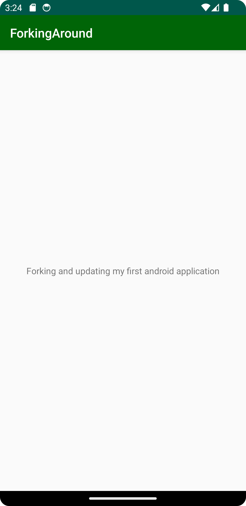

# Rapport

ändrade namn på label som den visas under samt app-name.

    <activity
    android:name=".MainActivity"
    android:label="ForkingAround"
    android:theme="@style/AppTheme.NoActionBar">
    <intent-filter>
    <action android:name="android.intent.action.MAIN" />

                <category android:name="android.intent.category.LAUNCHER" />
            </intent-filter>
        </activity>

